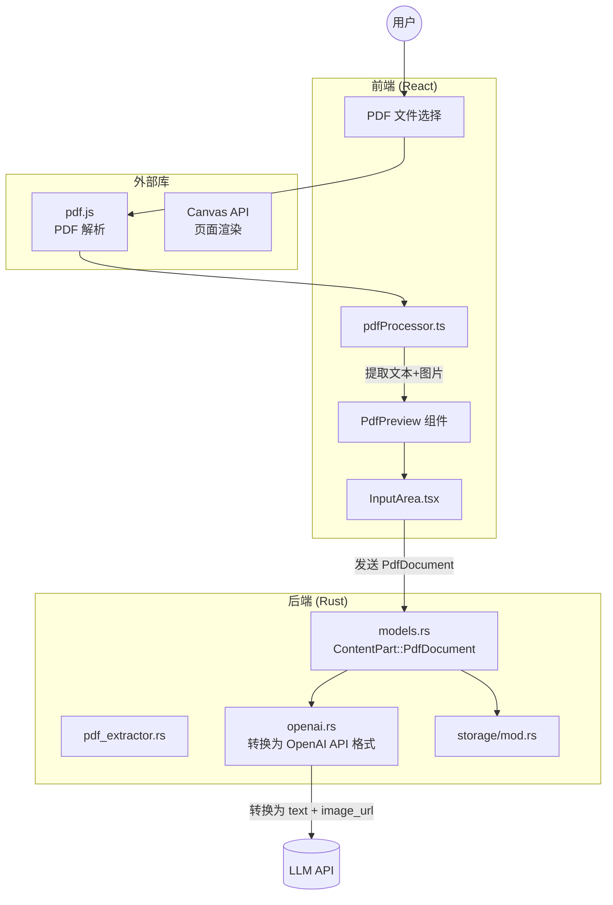
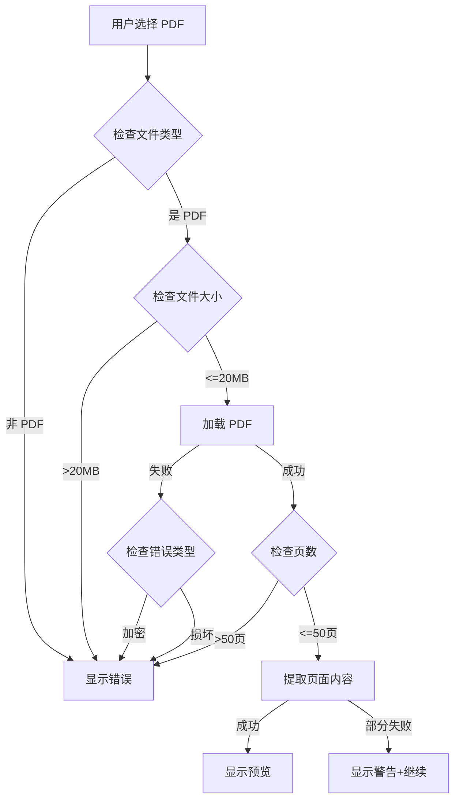

# Design Document: PDF 多模态解读功能

## Overview

本设计文档描述了 TauriAI 聊天应用中 PDF 多模态解读功能的技术实现方案。该功能允许用户上传 PDF 文档，系统将提取每一页的文本和图像，并以多模态格式（文本+图片）发送给 LLM 进行智能分析。

设计遵循现有的多模态内容架构，扩展 `ContentPart` 数据结构以支持 PDF 文档的页面级别处理。

## Architecture



## Data Models

### 1. 前端类型定义 (TypeScript)

```typescript
/**
 * PDF 单页数据
 */
export interface PdfPage {
  pageNumber: number;      // 页码（从 1 开始）
  text: string;            // 提取的文本内容
  image: string;           // Base64 data URL (PNG 格式)
}

/**
 * PDF 元数据
 */
export interface PdfMetadata {
  title?: string;          // 文档标题
  author?: string;         // 作者
  createdAt?: string;      // 创建时间
  producer?: string;       // PDF 生成器
  subject?: string;        // 主题
  keywords?: string;       // 关键词
}

/**
 * PDF 文档 ContentPart
 */
export interface PdfDocumentContentPart {
  type: 'pdf_document';
  filename: string;        // 文件名
  pages: PdfPage[];        // 页面数组
  totalPages: number;      // 总页数
  metadata?: PdfMetadata;  // 文档元数据
}

/**
 * 待发送的 PDF 文件（前端预览用）
 */
export interface PendingPdf {
  id: string;              // 唯一标识符
  filename: string;        // 文件名
  size: number;            // 文件大小（字节）
  pages: PdfPage[];        // 已处理的页面
  totalPages: number;      // 总页数
  metadata?: PdfMetadata;  // 元数据
  processingProgress: number;  // 处理进度 (0-100)
}

/**
 * 扩展 ContentPart 类型
 */
export type ContentPart = 
  | TextContentPart 
  | ImageContentPart 
  | TextFileContentPart
  | PdfDocumentContentPart;

/**
 * PDF 相关常量
 */
export const MAX_PDF_SIZE = 20 * 1024 * 1024;  // 20MB
export const MAX_PDF_PAGES = 50;                // 最多处理 50 页
export const PDF_IMAGE_SCALE = 2.0;             // 渲染缩放比例（提高清晰度）
export const PDF_IMAGE_FORMAT = 'image/png';   // 图片格式
```

### 2. 后端数据模型 (Rust)

```rust
/// PDF 单页数据
#[derive(Debug, Clone, Serialize, Deserialize, PartialEq)]
pub struct PdfPage {
    pub page_number: u32,
    pub text: String,
    pub image: String,  // Base64 data URL
}

/// PDF 元数据
#[derive(Debug, Clone, Serialize, Deserialize, PartialEq)]
pub struct PdfMetadata {
    #[serde(skip_serializing_if = "Option::is_none")]
    pub title: Option<String>,
    #[serde(skip_serializing_if = "Option::is_none")]
    pub author: Option<String>,
    #[serde(skip_serializing_if = "Option::is_none")]
    pub created_at: Option<String>,
    #[serde(skip_serializing_if = "Option::is_none")]
    pub producer: Option<String>,
    #[serde(skip_serializing_if = "Option::is_none")]
    pub subject: Option<String>,
    #[serde(skip_serializing_if = "Option::is_none")]
    pub keywords: Option<String>,
}

/// ContentPart 枚举扩展
#[derive(Debug, Clone, Serialize, Deserialize, PartialEq)]
#[serde(tag = "type", rename_all = "snake_case")]
pub enum ContentPart {
    Text { text: String },
    Image { url: String, #[serde(default)] detail: ImageDetail },
    TextFile { filename: String, content: String },
    /// PDF 文档（多模态：文本+图片）
    PdfDocument {
        filename: String,
        pages: Vec<PdfPage>,
        total_pages: u32,
        #[serde(skip_serializing_if = "Option::is_none")]
        metadata: Option<PdfMetadata>,
    },
}

impl ContentPart {
    /// Create a PDF document content part
    pub fn pdf_document(
        filename: impl Into<String>,
        pages: Vec<PdfPage>,
        metadata: Option<PdfMetadata>,
    ) -> Self {
        let total_pages = pages.len() as u32;
        Self::PdfDocument {
            filename: filename.into(),
            pages,
            total_pages,
            metadata,
        }
    }
}
```

### 3. OpenAI API 转换格式

在 `openai.rs` 中，`PdfDocument` 将被转换为交替的文本和图片 ContentPart：

```rust
ContentPart::PdfDocument { filename, pages, .. } => {
    // 为每一页生成 [文本, 图片] 的组合
    pages.iter().flat_map(|page| {
        vec![
            OpenAiContentPart::Text {
                text: format!(
                    "📄 {} - 第{}页\n```\n{}\n```",
                    filename,
                    page.page_number,
                    page.text
                )
            },
            OpenAiContentPart::ImageUrl {
                image_url: ImageUrlData {
                    url: page.image.clone(),
                    detail: Some("high".to_string()),
                }
            }
        ]
    }).collect()
}
```

**发送给 LLM 的最终格式示例：**

```json
{
  "role": "user",
  "content": [
    {"type": "text", "text": "请分析这个 PDF 文档"},
    {"type": "text", "text": "📄 report.pdf - 第1页\n```\n第一页的文本内容...\n```"},
    {"type": "image_url", "image_url": {"url": "data:image/png;base64,...", "detail": "high"}},
    {"type": "text", "text": "📄 report.pdf - 第2页\n```\n第二页的文本内容...\n```"},
    {"type": "image_url", "image_url": {"url": "data:image/png;base64,...", "detail": "high"}}
  ]
}
```

## Components and Interfaces

### 1. 前端 PDF 处理模块

#### 1.1 PDF 处理工具函数 (`pdfUtils.ts`)

```typescript
/**
 * 验证 PDF 文件
 */
export function isValidPdfFile(file: File): boolean;

/**
 * 验证 PDF 文件大小
 */
export function validatePdfSize(file: File): boolean;

/**
 * 处理 PDF 文件，提取所有页面的文本和图片
 */
export async function processPdfFile(
  file: File,
  onProgress?: (progress: number) => void
): Promise<PendingPdf>;

/**
 * 提取单页内容
 */
async function extractPageContent(
  page: PDFPageProxy,
  pageNumber: number,
  scale: number
): Promise<PdfPage>;
```

#### 1.2 PDF 预览组件 (`PdfPreview.tsx`)

```typescript
interface PdfPreviewProps {
  pdf: PendingPdf;
  onRemove: (id: string) => void;
  onPageSelect?: (pageNumbers: number[]) => void;  // 可选：选择特定页面
}

/**
 * PDF 预览卡片组件
 * - 显示 PDF 文件名和元数据
 * - 显示页面缩略图网格
 * - 显示处理进度
 * - 提供删除按钮
 * - 可选：支持选择特定页面发送
 */
export const PdfPreview: React.FC<PdfPreviewProps>;
```

### 2. 前端集成到 InputArea

扩展 `InputArea.tsx`：

```typescript
const [pendingPdfs, setPendingPdfs] = useState<PendingPdf[]>([]);
const [pdfError, setPdfError] = useState<string | null>(null);
const pdfFileInputRef = useRef<HTMLInputElement>(null);

/**
 * 处理 PDF 文件选择
 */
const handlePdfSelect = useCallback(async (files: FileList | null) => {
  if (!files || files.length === 0) return;
  
  setPdfError(null);
  
  for (const file of Array.from(files)) {
    if (!isValidPdfFile(file)) {
      setPdfError('只支持 PDF 文件');
      continue;
    }
    
    if (!validatePdfSize(file)) {
      setPdfError(`PDF 文件过大，请选择小于 ${MAX_PDF_SIZE / 1024 / 1024}MB 的文件`);
      continue;
    }
    
    try {
      const pendingPdf = await processPdfFile(file, (progress) => {
        // 更新处理进度
      });
      setPendingPdfs(prev => [...prev, pendingPdf]);
    } catch (err) {
      setPdfError(err instanceof Error ? err.message : 'PDF 处理失败');
    }
  }
}, []);

/**
 * 发送消息时包含 PDF
 */
const handleSend = useCallback(() => {
  // ...现有逻辑
  
  // 添加 PDF content parts
  for (const pdf of pendingPdfs) {
    contentParts.push({
      type: 'pdf_document' as const,
      filename: pdf.filename,
      pages: pdf.pages,
      totalPages: pdf.totalPages,
      metadata: pdf.metadata,
    });
  }
  
  onSend(trimmedContent, enableThinking, contentParts);
  setPendingPdfs([]);
}, [pendingPdfs, /* ...其他依赖 */]);
```

### 3. 后端 OpenAI 客户端扩展

在 `openai.rs` 的 `convert_messages` 函数中添加 PDF 处理：

```rust
fn convert_messages(
    messages: &[Message],
    system_prompt: Option<&str>,
    system_role: SystemRole,
) -> Vec<OpenAiMessage> {
    // ...现有逻辑
    
    for msg in messages {
        let content = if msg.has_multimodal_content() {
            let mut parts = Vec::new();
            
            for part in msg.get_content_parts() {
                match part {
                    ContentPart::Text { text } => {
                        parts.push(OpenAiContentPart::Text { text });
                    }
                    ContentPart::Image { url, detail } => {
                        parts.push(OpenAiContentPart::ImageUrl {
                            image_url: ImageUrlData { url, detail: /* ... */ },
                        });
                    }
                    ContentPart::TextFile { filename, content } => {
                        parts.push(OpenAiContentPart::Text {
                            text: format!("📄 {}\n```\n{}\n```", filename, content),
                        });
                    }
                    ContentPart::PdfDocument { filename, pages, .. } => {
                        // 为每一页添加文本+图片
                        for page in pages {
                            // 添加页面文本
                            parts.push(OpenAiContentPart::Text {
                                text: format!(
                                    "📄 {} - 第{}页\n```\n{}\n```",
                                    filename,
                                    page.page_number,
                                    page.text
                                ),
                            });
                            // 添加页面图片
                            parts.push(OpenAiContentPart::ImageUrl {
                                image_url: ImageUrlData {
                                    url: page.image.clone(),
                                    detail: Some("high".to_string()),
                                },
                            });
                        }
                    }
                }
            }
            
            OpenAiContent::Parts(parts)
        } else {
            OpenAiContent::Text(msg.content.clone())
        }
        
        // ...
    }
}
```

## Error Handling

### 错误类型和消息

| 错误场景 | 错误消息 |
|---------|---------|
| 非 PDF 文件 | "只支持 PDF 文件" |
| 文件过大 (>20MB) | "PDF 文件过大，请选择小于 20MB 的文件" |
| 页数超限 (>50页) | "PDF 页数过多，最多支持 50 页" |
| PDF 损坏 | "PDF 文件损坏，无法读取" |
| PDF 加密 | "PDF 文件受密码保护，请提供无密码保护的版本" |
| 文本提取失败 | "文本提取失败，将仅使用页面图像" |
| 图片渲染失败 | "页面图像生成失败" |
| 处理超时 | "PDF 处理超时，请尝试较小的文件" |

### 错误处理流程



## Performance Optimization

### 1. 分页处理策略

```typescript
/**
 * 分批处理 PDF 页面，避免阻塞 UI
 */
async function processPdfFile(
  file: File,
  onProgress?: (progress: number) => void
): Promise<PendingPdf> {
  const pdf = await pdfjsLib.getDocument(URL.createObjectURL(file)).promise;
  const totalPages = Math.min(pdf.numPages, MAX_PDF_PAGES);
  const pages: PdfPage[] = [];
  
  // 分批处理，每批 5 页
  const BATCH_SIZE = 5;
  for (let i = 0; i < totalPages; i += BATCH_SIZE) {
    const batch = [];
    for (let j = i; j < Math.min(i + BATCH_SIZE, totalPages); j++) {
      batch.push(extractPageContent(await pdf.getPage(j + 1), j + 1, PDF_IMAGE_SCALE));
    }
    const batchResults = await Promise.all(batch);
    pages.push(...batchResults);
    
    // 更新进度
    onProgress?.((pages.length / totalPages) * 100);
    
    // 让出控制权，避免阻塞 UI
    await new Promise(resolve => setTimeout(resolve, 0));
  }
  
  return { /* ... */ };
}
```

### 2. 图片压缩

```typescript
/**
 * 压缩页面图片以减少数据量
 */
async function compressPageImage(
  canvas: HTMLCanvasElement,
  quality: number = 0.8
): Promise<string> {
  return canvas.toDataURL('image/jpeg', quality);  // 使用 JPEG 压缩
}
```

### 3. Token 估算

```typescript
/**
 * 估算 PDF 的 token 使用量
 */
export function estimatePdfTokens(pdf: PendingPdf): number {
  let tokens = 0;
  
  for (const page of pdf.pages) {
    // 文本 tokens（粗略估算：1 token ≈ 4 字符）
    tokens += Math.ceil(page.text.length / 4);
    
    // 图片 tokens（根据 OpenAI 定价）
    // high detail: 约 765 tokens per image
    tokens += 765;
  }
  
  return tokens;
}
```

## Testing Strategy

### 单元测试

1. **PDF 验证测试**
   - 测试文件类型验证
   - 测试文件大小限制
   - 测试页数限制

2. **PDF 处理测试**
   - 测试文本提取
   - 测试图片渲染
   - 测试元数据提取

3. **ContentPart 序列化测试**
   - 测试 PdfDocument 的 JSON 序列化
   - 测试 PdfDocument 的 JSON 反序列化
   - 测试往返转换

### 集成测试

1. **完整流程测试**
   - 上传 PDF → 处理 → 预览 → 发送 → LLM 响应
   - 测试多页 PDF
   - 测试包含图片的 PDF

2. **错误场景测试**
   - 测试加密 PDF
   - 测试损坏 PDF
   - 测试超大 PDF

## Implementation Notes

### 前端依赖

```json
{
  "dependencies": {
    "pdfjs-dist": "^4.0.0"  // PDF.js 库
  }
}
```

### PDF.js 配置

```typescript
import * as pdfjsLib from 'pdfjs-dist';

// 配置 worker
pdfjsLib.GlobalWorkerOptions.workerSrc = 
  `//cdnjs.cloudflare.com/ajax/libs/pdf.js/${pdfjsLib.version}/pdf.worker.min.js`;
```

### 后端无需额外依赖

后端只负责存储和转发 PDF ContentPart，所有 PDF 处理在前端完成。

## Future Enhancements

1. **OCR 支持**：对扫描版 PDF 进行 OCR 识别
2. **页面选择**：允许用户选择特定页面发送
3. **智能摘要**：自动生成 PDF 摘要
4. **表格识别**：识别并结构化提取表格数据
5. **批注支持**：保留 PDF 中的批注和高亮
