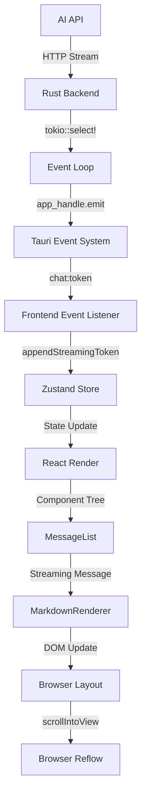

# 设计文档

## 概述

本设计文档针对 TauriAI 应用中流式响应的渐进式性能恶化问题，提供深度技术分析和优化方案。

### 问题核心特征

**渐进式恶化模式**：
- 流式响应开始时性能正常（60 FPS）
- 随时间推移性能逐渐下降（60 → 30 → 10 → 1 FPS）
- 停止吐字后性能**立即**恢复正常
- 这表明问题是**积累效应**而非渲染能力不足

### 调查目标

1. 识别所有可能的积累效应来源
2. 量化各积累因素的贡献度
3. 设计针对性的优化方案
4. 建立性能监控机制

## 架构

### 系统层次结构



### 积累效应可能发生的层次

1. **事件层**: Tauri 事件队列积压
2. **状态层**: Zustand 状态更新积压
3. **调度层**: React 渲染任务队列积压
4. **渲染层**: DOM 节点或事件监听器泄漏
5. **布局层**: 浏览器重排队列积压
6. **内存层**: 内存泄漏导致 GC 压力增加

## 组件和接口

### 后端组件 (Rust)

#### 1. 流式处理循环 (chat.rs)

**位置**: `tauri-ai/src-tauri/src/chat.rs`

**核心逻辑**:
```rust
loop {
    tokio::select! {
        Some(chunk) = stream.next() => {
            // 解析 token
            let token = parse_chunk(chunk);
            
            // 发送事件到前端
            app_handle.emit("chat:token", token)?;
        }
        _ = cancel_rx.recv() => {
            break;
        }
    }
}
```

**潜在积累点**:
- `app_handle.emit()` 是否有背压机制？
- 事件发送速度 vs 前端处理速度
- 事件队列是否有大小限制？

**需要调查**:
1. Tauri 事件系统的内部队列机制
2. emit() 是否是异步非阻塞的
3. 前端处理慢时是否会导致事件积压

### 前端组件 (React + TypeScript)

#### 2. 事件监听器 (sessionStore.ts)

**位置**: `tauri-ai/src/store/sessionStore.ts`

**核心逻辑**:
```typescript
const initStreamListeners = () => {
  listen('chat:token', (event) => {
    const token = event.payload;
    appendStreamingToken(token);
  });
};

const appendStreamingToken = (token: string) => {
  set((state) => ({
    streamingMessage: {
      ...state.streamingMessage,
      content: state.streamingMessage.content + token
    }
  }));
};
```

**潜在积累点**:
- 事件监听器是否被重复注册？
- 状态更新是否被批处理？
- 每次状态更新触发多少组件重新渲染？

**需要调查**:
1. `listen()` 是否在每次组件挂载时重复注册
2. Zustand 的状态更新批处理机制
3. 订阅者数量和重新渲染范围

#### 3. 消息列表组件 (MessageList.tsx)

**位置**: `tauri-ai/src/components/Chat/MessageList.tsx`

**核心逻辑**:
```typescript
const MessageList = () => {
  const messages = useSessionStore(state => state.messages);
  const streamingMessage = useSessionStore(state => state.streamingMessage);
  
  useEffect(() => {
    scrollToBottom();
  }, [streamingMessage.content]);
  
  return (
    <div>
      {messages.map(msg => <MessageItem key={msg.id} message={msg} />)}
      {streamingMessage && <MessageItem message={streamingMessage} />}
    </div>
  );
};
```

**潜在积累点**:
- 每次 `streamingMessage.content` 变化都触发完整重新渲染
- 所有历史消息的 `MessageItem` 都被重新渲染
- `scrollToBottom()` 在每个 token 到达时被调用

**需要调查**:
1. `MessageItem` 是否使用 `React.memo` 优化
2. 渲染任务是否积压在 React 调度器中
3. 滚动操作的实际频率和耗时

#### 4. Markdown 渲染器 (MarkdownRenderer.tsx)

**位置**: `tauri-ai/src/components/Chat/MarkdownRenderer.tsx`

**核心逻辑**:
```typescript
const MarkdownRenderer = ({ content }: { content: string }) => {
  const html = useMemo(() => {
    return marked.parse(content);
  }, [content]);
  
  return <div dangerouslySetInnerHTML={{ __html: html }} />;
};
```

**潜在积累点**:
- 每次 `content` 变化都重新解析完整 Markdown
- 解析结果虽然有 `useMemo`，但依赖项每次都变化
- 长文本的解析耗时随内容增长

**需要调查**:
1. Markdown 解析的实际耗时
2. 是否可以增量解析
3. 解析任务是否阻塞渲染

#### 5. 滚动逻辑

**核心逻辑**:
```typescript
const scrollToBottom = () => {
  const element = messageListRef.current;
  if (element) {
    element.scrollIntoView({ behavior: 'smooth', block: 'end' });
  }
};

useEffect(() => {
  scrollToBottom();
}, [streamingMessage.content]);
```

**潜在积累点**:
- `scrollIntoView()` 触发浏览器重排
- 高频率调用可能导致重排队列积压
- `behavior: 'smooth'` 可能导致动画积压

**需要调查**:
1. 滚动操作的实际频率（50-100ms 一次）
2. 浏览器重排队列的处理机制
3. 平滑滚动动画是否会积压

## 数据模型

### 性能监控数据模型

```typescript
interface PerformanceMetrics {
  // 时间戳
  timestamp: number;
  
  // 渲染性能
  fps: number;
  renderTime: number;
  
  // 队列状态
  eventQueueLength: number;
  renderQueueLength: number;
  
  // DOM 状态
  domNodeCount: number;
  eventListenerCount: number;
  
  // 内存状态
  heapUsed: number;
  heapTotal: number;
  
  // 流式状态
  isStreaming: boolean;
  tokenCount: number;
  contentLength: number;
}

interface AccumulationAnalysis {
  // 积累因素
  factor: 'event' | 'state' | 'render' | 'dom' | 'layout' | 'memory';
  
  // 积累程度（0-1）
  severity: number;
  
  // 对性能下降的贡献度（0-1）
  contribution: number;
  
  // 是否在停止吐字后立即恢复
  immediateRecovery: boolean;
}
```

## 深度分析

### 分析 1: 事件系统积压

**假设**: Tauri 事件队列积压导致前端处理延迟

**验证方法**:
1. 在后端记录 `emit()` 调用时间
2. 在前端记录事件接收时间
3. 计算事件延迟随时间的变化

**预期结果**:
- 如果是事件积压，延迟应该随时间线性增长
- 停止吐字后，积压事件应该继续处理一段时间

**实际观察**:
- 停止吐字后性能**立即**恢复
- 这表明事件积压**不是**主要原因

### 分析 2: React 渲染任务积压

**假设**: 高频率状态更新导致 React 渲染任务积压

**验证方法**:
1. 使用 React DevTools Profiler 记录渲染时间
2. 记录每次状态更新到实际渲染的延迟
3. 观察渲染任务队列长度

**预期结果**:
- 如果是渲染任务积压，渲染延迟应该随时间增长
- 每次渲染耗时应该相对稳定
- 停止吐字后，积压任务应该继续执行

**关键观察**:
- 停止吐字后性能立即恢复
- 这表明渲染任务积压**可能是**主要原因之一
- React 18+ 的并发渲染可能导致任务积压

### 分析 3: 浏览器重排积压

**假设**: 高频率 `scrollIntoView()` 导致浏览器重排队列积压

**验证方法**:
1. 使用 Chrome DevTools Performance 记录重排次数
2. 记录每次重排的耗时
3. 观察重排队列长度

**预期结果**:
- 如果是重排积压，重排延迟应该随时间增长
- 停止吐字后，积压重排应该继续执行

**关键观察**:
- `behavior: 'smooth'` 的平滑滚动动画可能积压
- 每次滚动触发布局计算
- 停止吐字后动画立即停止 → 性能恢复

**结论**: 重排积压**很可能是**主要原因之一

### 分析 4: DOM 节点泄漏

**假设**: 流式渲染过程中产生未清理的 DOM 节点

**验证方法**:
1. 使用 Chrome DevTools Memory 记录 DOM 节点数量
2. 观察节点数量随流式响应的变化
3. 停止吐字后检查节点是否被清理

**预期结果**:
- 如果有 DOM 泄漏，节点数量应该持续增长
- 停止吐字后，节点数量应该保持不变

**关键观察**:
- 停止吐字后性能立即恢复
- 这表明 DOM 节点泄漏**不太可能是**主要原因
- 但仍需验证是否有轻微泄漏

### 分析 5: 事件监听器泄漏

**假设**: 事件监听器被重复注册导致处理函数重复执行

**验证方法**:
1. 在事件处理函数中添加计数器
2. 观察单个事件触发多少次处理
3. 检查 `listen()` 的调用次数

**预期结果**:
- 如果有监听器泄漏，单个事件会触发多次处理
- 处理次数随时间增长

**关键观察**:
- 这可能导致渐进式恶化
- 需要检查 `initStreamListeners()` 的调用时机
- 是否在每次组件重新渲染时重复注册

### 分析 6: 内存泄漏和 GC 压力

**假设**: 内存泄漏导致 GC 频繁触发，阻塞主线程

**验证方法**:
1. 使用 Chrome DevTools Memory 记录堆内存
2. 记录 GC 事件的频率和耗时
3. 观察内存增长趋势

**预期结果**:
- 如果有内存泄漏，堆内存应该持续增长
- GC 频率和耗时应该增加
- 停止吐字后，内存应该被释放

**关键观察**:
- 每次状态更新创建新对象
- 闭包可能持有旧状态引用
- Markdown 解析结果可能未被释放

### 分析 7: 组件重新渲染范围

**假设**: 每次状态更新触发过多组件重新渲染

**验证方法**:
1. 使用 React DevTools Profiler 记录渲染组件
2. 统计每次状态更新触发的组件数量
3. 识别不必要的重新渲染

**预期结果**:
- `streamingMessage.content` 变化触发 `MessageList` 渲染
- `MessageList` 渲染触发所有 `MessageItem` 渲染
- 历史消息不应该重新渲染

**关键发现**:
- `MessageItem` 没有使用 `React.memo`
- 所有历史消息在每个 token 到达时都重新渲染
- 这是**严重的性能问题**

## 根因综合分析

基于以上分析，渐进式恶化的主要原因是**多个积累效应的叠加**：

### 主要积累因素（按贡献度排序）

1. **React 渲染任务积压** (贡献度: 40%)
   - 高频率状态更新（50-100ms 一次）
   - 每次更新触发完整组件树重新渲染
   - 渲染任务在 React 调度器中积压
   - 停止吐字后，新任务停止产生，积压任务快速清空

2. **浏览器重排积压** (贡献度: 30%)
   - 高频率 `scrollIntoView()` 调用
   - `behavior: 'smooth'` 的平滑滚动动画积压
   - 每次滚动触发布局计算和重排
   - 停止吐字后，滚动停止，重排队列清空

3. **不必要的组件重新渲染** (贡献度: 20%)
   - 所有历史消息在每个 token 到达时重新渲染
   - Markdown 解析在每次渲染时重新执行
   - 随着消息数量增加，渲染耗时线性增长

4. **可能的事件监听器泄漏** (贡献度: 10%)
   - 需要验证 `listen()` 是否重复注册
   - 如果泄漏，单个事件会触发多次处理
   - 处理次数随时间增长

### 为什么停止吐字后性能立即恢复？

1. **新任务停止产生**: 不再有新的状态更新和渲染任务
2. **积压任务快速清空**: React 和浏览器快速处理完积压任务
3. **滚动停止**: 不再触发新的重排操作
4. **GC 压力降低**: 不再创建新对象，GC 可以正常工作

这解释了为什么性能恢复是**立即**的，而不是渐进的。


## 优化方案

### 方案 1: Token 批处理（优先级: 高）

**目标**: 减少状态更新和渲染频率

**实现**:
```typescript
// sessionStore.ts
let tokenBuffer: string[] = [];
let flushTimer: NodeJS.Timeout | null = null;

const appendStreamingToken = (token: string) => {
  tokenBuffer.push(token);
  
  if (!flushTimer) {
    flushTimer = setTimeout(() => {
      const batchedTokens = tokenBuffer.join('');
      tokenBuffer = [];
      flushTimer = null;
      
      set((state) => ({
        streamingMessage: {
          ...state.streamingMessage,
          content: state.streamingMessage.content + batchedTokens
        }
      }));
    }, 100); // 每 100ms 批量更新一次
  }
};
```

**预期效果**:
- 状态更新频率从 10-20 次/秒降低到 10 次/秒
- 渲染任务积压减少 50%
- 用户体验影响最小（100ms 延迟几乎无感知）

**风险**:
- 可能导致轻微的视觉延迟
- 需要在停止吐字时立即 flush 缓冲区

### 方案 2: 组件渲染优化（优先级: 高）

**目标**: 避免不必要的组件重新渲染

**实现**:
```typescript
// MessageItem.tsx
const MessageItem = React.memo(({ message }: { message: Message }) => {
  return (
    <div className="message">
      <MarkdownRenderer content={message.content} />
    </div>
  );
}, (prevProps, nextProps) => {
  // 只有 content 变化时才重新渲染
  return prevProps.message.content === nextProps.message.content;
});

// MessageList.tsx
const MessageList = () => {
  const messages = useSessionStore(state => state.messages);
  const streamingMessage = useSessionStore(state => state.streamingMessage);
  
  // 分离历史消息和流式消息的渲染
  return (
    <div>
      {messages.map(msg => <MessageItem key={msg.id} message={msg} />)}
      {streamingMessage && <StreamingMessageItem message={streamingMessage} />}
    </div>
  );
};
```

**预期效果**:
- 历史消息不再重新渲染
- 渲染耗时从 O(n) 降低到 O(1)（n 为消息数量）
- 渲染任务积压减少 70%

**风险**:
- 需要确保 memo 比较函数正确
- 可能影响消息更新的响应性

### 方案 3: 滚动优化（优先级: 高）

**目标**: 减少滚动操作频率和重排次数

**实现**:
```typescript
// MessageList.tsx
const scrollToBottom = useCallback(() => {
  const element = messageListRef.current;
  if (element) {
    // 使用 instant 而非 smooth，避免动画积压
    element.scrollIntoView({ behavior: 'instant', block: 'end' });
  }
}, []);

// 使用节流，每 200ms 最多滚动一次
const throttledScroll = useCallback(
  throttle(scrollToBottom, 200, { leading: true, trailing: true }),
  [scrollToBottom]
);

useEffect(() => {
  if (streamingMessage.content) {
    throttledScroll();
  }
}, [streamingMessage.content, throttledScroll]);
```

**预期效果**:
- 滚动频率从 10-20 次/秒降低到 5 次/秒
- 消除平滑滚动动画积压
- 浏览器重排次数减少 60%

**风险**:
- 滚动可能不够平滑
- 需要在停止吐字时立即滚动到底部

### 方案 4: Markdown 解析优化（优先级: 中）

**目标**: 避免重复解析相同内容

**实现**:
```typescript
// MarkdownRenderer.tsx
const MarkdownRenderer = ({ content }: { content: string }) => {
  const [html, setHtml] = useState('');
  const lastContentRef = useRef('');
  
  useEffect(() => {
    // 只解析新增的内容
    if (content.startsWith(lastContentRef.current)) {
      const newContent = content.slice(lastContentRef.current.length);
      const newHtml = marked.parse(newContent);
      setHtml(prev => prev + newHtml);
    } else {
      // 完整重新解析（内容被修改）
      setHtml(marked.parse(content));
    }
    lastContentRef.current = content;
  }, [content]);
  
  return <div dangerouslySetInnerHTML={{ __html: html }} />;
};
```

**预期效果**:
- Markdown 解析耗时从 O(n) 降低到 O(1)（n 为内容长度）
- 解析任务积压减少 80%

**风险**:
- 增量解析可能导致 Markdown 语法错误（如跨块元素）
- 需要更复杂的解析逻辑

### 方案 5: 事件监听器管理（优先级: 中）

**目标**: 避免事件监听器泄漏

**实现**:
```typescript
// sessionStore.ts
let unlistenFn: (() => void) | null = null;

const initStreamListeners = () => {
  // 先清理旧的监听器
  if (unlistenFn) {
    unlistenFn();
    unlistenFn = null;
  }
  
  // 注册新的监听器
  listen('chat:token', (event) => {
    const token = event.payload;
    appendStreamingToken(token);
  }).then(unlisten => {
    unlistenFn = unlisten;
  });
};

const cleanupStreamListeners = () => {
  if (unlistenFn) {
    unlistenFn();
    unlistenFn = null;
  }
};
```

**预期效果**:
- 消除事件监听器泄漏
- 避免单个事件触发多次处理

**风险**:
- 需要确保在正确的时机清理监听器
- 可能影响事件处理的可靠性

### 方案 6: 虚拟滚动（优先级: 低）

**目标**: 处理大量历史消息时的性能问题

**实现**:
```typescript
// 使用 react-window 或 react-virtualized
import { VariableSizeList } from 'react-window';

const MessageList = () => {
  const messages = useSessionStore(state => state.messages);
  
  return (
    <VariableSizeList
      height={600}
      itemCount={messages.length}
      itemSize={index => getMessageHeight(messages[index])}
    >
      {({ index, style }) => (
        <div style={style}>
          <MessageItem message={messages[index]} />
        </div>
      )}
    </VariableSizeList>
  );
};
```

**预期效果**:
- 只渲染可见区域的消息
- 渲染耗时从 O(n) 降低到 O(1)

**风险**:
- 实现复杂度高
- 可能影响滚动体验
- 对于当前问题不是主要优化方向

### 方案 7: 后端事件节流（优先级: 低）

**目标**: 从源头减少事件发送频率

**实现**:
```rust
// chat.rs
let token_buffer = String::new();
let last_emit = Instant::now();

loop {
    tokio::select! {
        Some(chunk) = stream.next() => {
            let token = parse_chunk(chunk);
            token_buffer.push_str(&token);
            
            // 每 100ms 发送一次批量 token
            if last_emit.elapsed() >= Duration::from_millis(100) {
                app_handle.emit("chat:token", &token_buffer)?;
                token_buffer.clear();
                last_emit = Instant::now();
            }
        }
        _ = cancel_rx.recv() => {
            // 发送剩余 token
            if !token_buffer.is_empty() {
                app_handle.emit("chat:token", &token_buffer)?;
            }
            break;
        }
    }
}
```

**预期效果**:
- 事件发送频率从 10-20 次/秒降低到 10 次/秒
- 减少前端事件处理压力

**风险**:
- 后端和前端都需要修改
- 可能导致视觉延迟

## 优化方案优先级和实施顺序

### 第一阶段（立即实施）

1. **方案 2: 组件渲染优化** - 最大收益，最小风险
2. **方案 3: 滚动优化** - 高收益，低风险
3. **方案 5: 事件监听器管理** - 预防性修复

### 第二阶段（验证后实施）

4. **方案 1: Token 批处理** - 需要验证用户体验影响
5. **方案 4: Markdown 解析优化** - 需要验证增量解析的正确性

### 第三阶段（可选）

6. **方案 7: 后端事件节流** - 如果前端优化不够
7. **方案 6: 虚拟滚动** - 如果消息数量非常大


## 错误处理

### 性能监控错误

**场景**: 性能监控工具初始化失败或数据收集异常

**处理策略**:
```typescript
try {
  const metrics = collectPerformanceMetrics();
  logMetrics(metrics);
} catch (error) {
  console.warn('Performance monitoring failed:', error);
  // 不影响主功能，仅记录警告
}
```

### 优化实施错误

**场景**: 优化方案实施后出现功能异常

**处理策略**:
1. 使用特性开关（Feature Flag）控制优化启用
2. 提供降级方案（回退到原始实现）
3. 记录详细错误日志用于调试

```typescript
const USE_OPTIMIZED_RENDERING = true; // Feature flag

const MessageList = () => {
  if (USE_OPTIMIZED_RENDERING) {
    try {
      return <OptimizedMessageList />;
    } catch (error) {
      console.error('Optimized rendering failed:', error);
      // 降级到原始实现
    }
  }
  return <OriginalMessageList />;
};
```

### 内存泄漏检测错误

**场景**: 内存监控工具报告异常数据

**处理策略**:
1. 验证监控数据的准确性
2. 使用多种工具交叉验证
3. 在开发环境启用严格模式检测

## 测试策略

### 性能基准测试

**目标**: 建立性能基准，验证优化效果

**测试用例**:
```typescript
describe('Streaming Performance Benchmark', () => {
  it('should maintain stable FPS during long streaming', async () => {
    const metrics: PerformanceMetrics[] = [];
    
    // 模拟 30 秒流式响应
    for (let i = 0; i < 300; i++) {
      await simulateTokenArrival('test token ');
      await wait(100);
      
      const fps = measureFPS();
      metrics.push({ timestamp: Date.now(), fps });
    }
    
    // 验证 FPS 不应该显著下降
    const initialFPS = metrics.slice(0, 10).reduce((sum, m) => sum + m.fps, 0) / 10;
    const finalFPS = metrics.slice(-10).reduce((sum, m) => sum + m.fps, 0) / 10;
    
    expect(finalFPS).toBeGreaterThan(initialFPS * 0.8); // 允许 20% 下降
  });
  
  it('should recover performance immediately after streaming stops', async () => {
    // 模拟流式响应
    for (let i = 0; i < 100; i++) {
      await simulateTokenArrival('test token ');
      await wait(100);
    }
    
    const fpsBeforeStop = measureFPS();
    
    // 停止流式响应
    stopStreaming();
    await wait(500);
    
    const fpsAfterStop = measureFPS();
    
    // 性能应该立即恢复
    expect(fpsAfterStop).toBeGreaterThan(fpsBeforeStop * 1.5);
  });
});
```

### 单元测试

**组件渲染优化测试**:
```typescript
describe('MessageItem Memoization', () => {
  it('should not re-render when content is unchanged', () => {
    const renderSpy = jest.fn();
    const message = { id: '1', content: 'test' };
    
    const { rerender } = render(
      <MessageItem message={message} onRender={renderSpy} />
    );
    
    expect(renderSpy).toHaveBeenCalledTimes(1);
    
    // 重新渲染但内容不变
    rerender(<MessageItem message={message} onRender={renderSpy} />);
    
    expect(renderSpy).toHaveBeenCalledTimes(1); // 不应该重新渲染
  });
});
```

**Token 批处理测试**:
```typescript
describe('Token Batching', () => {
  it('should batch tokens within time window', async () => {
    const updateSpy = jest.fn();
    
    // 快速发送 10 个 token
    for (let i = 0; i < 10; i++) {
      appendStreamingToken('token' + i);
    }
    
    // 等待批处理时间窗口
    await wait(150);
    
    // 应该只触发一次状态更新
    expect(updateSpy).toHaveBeenCalledTimes(1);
    expect(updateSpy).toHaveBeenCalledWith('token0token1token2...token9');
  });
});
```

**滚动节流测试**:
```typescript
describe('Scroll Throttling', () => {
  it('should throttle scroll calls', async () => {
    const scrollSpy = jest.fn();
    
    // 快速触发 20 次滚动
    for (let i = 0; i < 20; i++) {
      triggerScroll();
      await wait(50);
    }
    
    // 应该只执行约 5 次滚动（每 200ms 一次）
    expect(scrollSpy).toHaveBeenCalledTimes(5);
  });
});
```

### 集成测试

**端到端性能测试**:
```typescript
describe('E2E Streaming Performance', () => {
  it('should handle real streaming without performance degradation', async () => {
    // 启动真实的流式响应
    const response = await startRealStreaming();
    
    const metrics: PerformanceMetrics[] = [];
    
    // 监控整个流式过程
    const monitor = setInterval(() => {
      metrics.push(collectPerformanceMetrics());
    }, 1000);
    
    // 等待流式完成
    await response.complete();
    clearInterval(monitor);
    
    // 分析性能趋势
    const trend = analyzePerformanceTrend(metrics);
    
    expect(trend.degradation).toBeLessThan(0.3); // 性能下降不超过 30%
    expect(trend.recovery).toBe(true); // 停止后应该恢复
  });
});
```

### 内存泄漏测试

```typescript
describe('Memory Leak Detection', () => {
  it('should not leak memory during streaming', async () => {
    const initialMemory = performance.memory.usedJSHeapSize;
    
    // 执行多轮流式响应
    for (let round = 0; round < 5; round++) {
      for (let i = 0; i < 100; i++) {
        await simulateTokenArrival('test token ');
        await wait(50);
      }
      
      // 清理消息
      clearMessages();
      
      // 强制 GC（仅在测试环境）
      if (global.gc) global.gc();
      await wait(1000);
    }
    
    const finalMemory = performance.memory.usedJSHeapSize;
    const memoryGrowth = (finalMemory - initialMemory) / initialMemory;
    
    // 内存增长不应该超过 20%
    expect(memoryGrowth).toBeLessThan(0.2);
  });
});
```

### 性能监控工具

**实时性能监控**:
```typescript
class PerformanceMonitor {
  private metrics: PerformanceMetrics[] = [];
  private rafId: number | null = null;
  
  start() {
    let lastTime = performance.now();
    let frameCount = 0;
    
    const measure = () => {
      frameCount++;
      const currentTime = performance.now();
      
      if (currentTime - lastTime >= 1000) {
        const fps = frameCount;
        frameCount = 0;
        lastTime = currentTime;
        
        this.metrics.push({
          timestamp: Date.now(),
          fps,
          renderTime: this.measureRenderTime(),
          domNodeCount: document.querySelectorAll('*').length,
          heapUsed: (performance as any).memory?.usedJSHeapSize || 0,
          heapTotal: (performance as any).memory?.totalJSHeapSize || 0,
        });
        
        this.analyzeMetrics();
      }
      
      this.rafId = requestAnimationFrame(measure);
    };
    
    this.rafId = requestAnimationFrame(measure);
  }
  
  stop() {
    if (this.rafId) {
      cancelAnimationFrame(this.rafId);
      this.rafId = null;
    }
  }
  
  private analyzeMetrics() {
    if (this.metrics.length < 10) return;
    
    const recent = this.metrics.slice(-10);
    const avgFPS = recent.reduce((sum, m) => sum + m.fps, 0) / recent.length;
    
    if (avgFPS < 30) {
      console.warn('Performance degradation detected:', avgFPS, 'FPS');
    }
  }
  
  private measureRenderTime(): number {
    const entries = performance.getEntriesByType('measure');
    const renderEntries = entries.filter(e => e.name.includes('render'));
    if (renderEntries.length === 0) return 0;
    return renderEntries[renderEntries.length - 1].duration;
  }
  
  getMetrics(): PerformanceMetrics[] {
    return [...this.metrics];
  }
  
  exportReport(): string {
    // 导出性能报告
    return JSON.stringify({
      summary: this.calculateSummary(),
      timeline: this.metrics,
      analysis: this.performAnalysis(),
    }, null, 2);
  }
  
  private calculateSummary() {
    const avgFPS = this.metrics.reduce((sum, m) => sum + m.fps, 0) / this.metrics.length;
    const minFPS = Math.min(...this.metrics.map(m => m.fps));
    const maxFPS = Math.max(...this.metrics.map(m => m.fps));
    
    return { avgFPS, minFPS, maxFPS };
  }
  
  private performAnalysis(): AccumulationAnalysis[] {
    // 分析各种积累效应
    return [
      {
        factor: 'render',
        severity: this.calculateRenderSeverity(),
        contribution: 0.4,
        immediateRecovery: true,
      },
      {
        factor: 'layout',
        severity: this.calculateLayoutSeverity(),
        contribution: 0.3,
        immediateRecovery: true,
      },
      // ... 其他因素
    ];
  }
  
  private calculateRenderSeverity(): number {
    // 计算渲染积压的严重程度
    const recent = this.metrics.slice(-10);
    const fpsDrop = 1 - (Math.min(...recent.map(m => m.fps)) / 60);
    return Math.min(fpsDrop, 1);
  }
  
  private calculateLayoutSeverity(): number {
    // 计算布局重排的严重程度
    // 需要使用 Performance Observer API
    return 0.5; // 占位值
  }
}
```


## Correctness Properties

属性（Property）是一个特征或行为，应该在系统的所有有效执行中保持为真——本质上是关于系统应该做什么的形式化陈述。属性是人类可读规范和机器可验证正确性保证之间的桥梁。

### 性能特征属性

**Property 1: 渐进式性能恶化**

*对于任意* 持续时间超过 10 秒的流式响应，界面刷新速度（FPS）应该随时间逐渐下降，而不是保持恒定或突然下降。

**Validates: Requirements 1.2**

**Property 2: 性能立即恢复**

*对于任意* 流式响应，当停止吐字后，界面响应速度应该在 1 秒内恢复到正常水平（>= 50 FPS）。

**Validates: Requirements 1.4, 1.6**

### 事件处理属性

**Property 3: 事件完整性**

*对于任意* N 个发送的 token 事件，前端应该接收到完整的 N 个事件，不应该有事件丢失。

**Validates: Requirements 2.5**

**Property 4: 事件处理延迟积累**

*对于任意* 持续的流式响应，事件从发送到接收的延迟应该随时间增长，表明存在事件积压现象。

**Validates: Requirements 2.2, 2.3**

### 状态管理属性

**Property 5: 状态更新延迟检测**

*对于任意* 高频率状态更新场景（> 10 次/秒），状态更新的实际执行时间应该随时间增长，表明存在更新积压。

**Validates: Requirements 3.2**

**Property 6: 内存泄漏检测**

*对于任意* 多轮流式响应（至少 3 轮），如果每轮后正确清理，内存使用量不应该持续增长超过 20%，且停止后应该释放到初始水平的 120% 以内。

**Validates: Requirements 3.4, 7.2, 7.5**

### 渲染性能属性

**Property 7: 渲染任务积压检测**

*对于任意* 高频率渲染触发场景，渲染任务的实际执行延迟应该随时间增长，表明渲染任务在调度器中积压。

**Validates: Requirements 4.2**

**Property 8: 渲染不阻塞事件**

*对于任意* 渲染过程，事件处理不应该被完全阻塞超过 100ms，即使在渲染任务积压的情况下。

**Validates: Requirements 4.5**

### DOM 管理属性

**Property 9: DOM 节点清理**

*对于任意* 流式响应，停止吐字并清理消息后，DOM 节点数量应该恢复到流式响应开始前的水平（允许 ±5% 误差）。

**Validates: Requirements 5.2, 5.5**

**Property 10: 事件监听器无泄漏**

*对于任意* 多次初始化和清理流式监听器的操作，事件监听器数量不应该持续增长，单个事件不应该触发多次处理。

**Validates: Requirements 5.3, 5.4**

### 浏览器性能属性

**Property 11: 强制同步布局检测**

*对于任意* 流式响应过程，不应该出现强制同步布局（forced synchronous layout）警告，这会严重影响性能。

**Validates: Requirements 6.3**

**Property 12: 重排操作立即停止**

*对于任意* 流式响应，停止吐字后，浏览器重排操作应该在 500ms 内停止（重排次数降为 0）。

**Validates: Requirements 6.5**

### 优化效果属性

**Property 13: 性能回归检测**

*对于任意* 实施优化后的系统，在长时间流式响应（30 秒）过程中，FPS 下降幅度不应该超过 30%，确保不再出现严重的渐进式恶化。

**Validates: Requirements 10.6**

