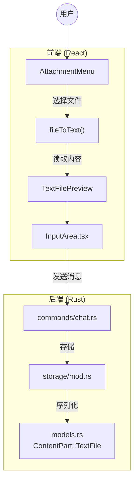
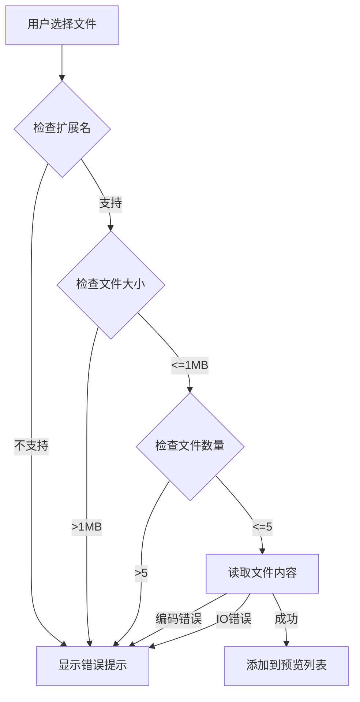

# Design Document: Text File Attachment

## Overview

本设计文档描述了 TauriAI 聊天应用中文本文件附件功能的技术实现方案。该功能允许用户上传文本文件，预览内容，并将文件内容作为消息的一部分发送给 AI。

设计遵循现有图片附件功能的架构模式，复用 `ContentPart` 数据结构和 `InputArea` 组件的附件处理逻辑。

## Architecture



## Components and Interfaces

### 1. 前端组件

#### 1.1 PendingTextFile 接口

```typescript
/**
 * 待发送的文本文件
 */
interface PendingTextFile {
  id: string;           // 唯一标识符
  filename: string;     // 文件名
  content: string;      // 文件内容
  size: number;         // 文件大小（字节）
}
```

#### 1.2 ContentPart 类型扩展

```typescript
// 扩展现有的 ContentPart 类型
type ContentPart = 
  | { type: 'text'; text: string }
  | { type: 'image'; url: string; detail?: 'auto' | 'low' | 'high' }
  | { type: 'text_file'; filename: string; content: string };
```

#### 1.3 文件读取函数

```typescript
/**
 * 支持的文本文件扩展名
 */
const SUPPORTED_TEXT_EXTENSIONS = [
  '.txt', '.md', '.json', '.yaml', '.yml', '.xml', '.csv', '.log',
  '.ini', '.toml', '.html', '.css', '.js', '.ts', '.py', '.rs',
  '.go', '.java', '.c', '.cpp', '.h', '.sh', '.bat', '.sql'
];

/**
 * 最大文件大小 (1MB)
 */
const MAX_TEXT_FILE_SIZE = 1 * 1024 * 1024;

/**
 * 最大附件数量
 */
const MAX_TEXT_FILES = 5;

/**
 * 检查文件扩展名是否支持
 */
function isSupportedTextFile(filename: string): boolean;

/**
 * 读取文本文件内容
 * @throws Error 如果文件过大、编码不支持或读取失败
 */
async function readTextFile(file: File): Promise<PendingTextFile>;
```

#### 1.4 TextFilePreview 组件

```typescript
interface TextFilePreviewProps {
  file: PendingTextFile;
  onRemove: (id: string) => void;
}

/**
 * 文本文件预览卡片组件
 * - 显示文件名和图标
 * - 显示内容预览（前500字符）
 * - 提供删除按钮
 */
const TextFilePreview: React.FC<TextFilePreviewProps>;
```

### 2. 后端数据模型

#### 2.1 ContentPart 枚举扩展

```rust
/// A single part of message content
#[derive(Debug, Clone, Serialize, Deserialize)]
#[serde(tag = "type", rename_all = "snake_case")]
pub enum ContentPart {
    /// Text content
    Text { text: String },
    /// Image content (base64 data URL or HTTP URL)
    Image {
        url: String,
        #[serde(default)]
        detail: ImageDetail,
    },
    /// Text file content
    TextFile {
        filename: String,
        content: String,
    },
}

impl ContentPart {
    /// Create a text file content part
    pub fn text_file(filename: impl Into<String>, content: impl Into<String>) -> Self {
        Self::TextFile {
            filename: filename.into(),
            content: content.into(),
        }
    }
}
```

## Data Models

### 消息内容格式

当用户发送包含文本文件的消息时，文件内容将被格式化为以下形式：

```
📄 example.json
```json
{
  "key": "value"
}
```
```

### 数据库存储

文本文件内容通过 `content_parts` 字段存储，使用 JSON 序列化：

```json
{
  "content_parts": [
    { "type": "text", "text": "请分析这个配置文件" },
    { "type": "text_file", "filename": "config.json", "content": "{...}" }
  ]
}
```

## Error Handling

### 错误类型和消息

| 错误场景 | 错误消息 |
|---------|---------|
| 文件过大 (>1MB) | "文件过大，请选择小于 1MB 的文件" |
| 不支持的扩展名 | "不支持的文件类型，请选择文本文件" |
| 编码错误 | "文件编码不支持，请使用 UTF-8 编码的文件" |
| 读取失败 | "读取文件失败: {error}" |
| 文件数量超限 | "最多只能添加 5 个文件" |

### 错误处理流程



## Testing Strategy

### 单元测试

1. **文件验证测试**
   - 测试 `isSupportedTextFile()` 对各种扩展名的判断
   - 测试文件大小限制检查
   - 测试文件数量限制检查

2. **文件读取测试**
   - 测试正常 UTF-8 文件读取
   - 测试空文件处理
   - 测试大文件拒绝

3. **ContentPart 序列化测试**
   - 测试 TextFile 类型的 JSON 序列化
   - 测试 TextFile 类型的 JSON 反序列化

### 属性测试

属性测试用于验证系统在各种输入下的正确性。

## Correctness Properties

*A property is a characteristic or behavior that should hold true across all valid executions of a system—essentially, a formal statement about what the system should do. Properties serve as the bridge between human-readable specifications and machine-verifiable correctness guarantees.*

### Property 1: Valid Text File Reading

*For any* file with a supported extension (.txt, .md, .json, etc.) and size <= 1MB, reading the file SHALL succeed and return a PendingTextFile with the correct filename and content.

**Validates: Requirements 1.3, 4.2, 5.1**

### Property 2: Extension Validation

*For any* filename, `isSupportedTextFile(filename)` SHALL return true if and only if the filename ends with one of the supported extensions (case-insensitive).

**Validates: Requirements 1.4, 4.3**

### Property 3: Size Validation

*For any* file with size > MAX_TEXT_FILE_SIZE (1MB), the file reader SHALL reject the file with an appropriate error message.

**Validates: Requirements 1.5, 4.4**

### Property 4: Content Truncation

*For any* file content string, the preview display SHALL show at most 500 characters, and if the original content length > 500, the preview SHALL include a truncation indicator.

**Validates: Requirements 2.2**

### Property 5: Message Formatting

*For any* filename and content, the formatted ContentPart text SHALL match the pattern: "📄 {filename}\n```\n{content}\n```"

**Validates: Requirements 3.1, 3.2, 3.4**

### Property 6: File Count Limit Invariant

*For any* sequence of file attachment operations, the number of pending files SHALL never exceed MAX_TEXT_FILES (5). Attempting to add files beyond this limit SHALL reject the excess files.

**Validates: Requirements 5.3, 5.4**

### Property 7: ContentPart Serialization Round-Trip

*For any* valid ContentPart::TextFile with arbitrary filename and content, serializing to JSON and then deserializing SHALL produce an equivalent ContentPart with the same filename and content.

**Validates: Requirements 6.2, 6.3, 6.4**

