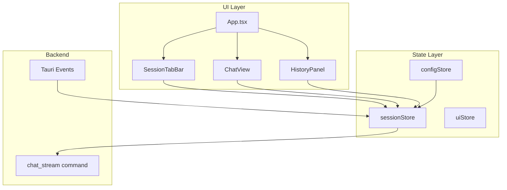

# Design Document: Multi-Agent Workspace

## Overview

本设计将应用从单智能体聊天模式重构为多智能体工作区模式。核心变化是引入 `SessionStore` 来管理多个独立的智能体会话，每个会话拥有独立的状态、消息历史和流式响应处理。

### 设计目标

1. **状态隔离**: 每个会话完全独立，互不干扰
2. **并发支持**: 多个会话可同时进行流式响应
3. **向后兼容**: 保持现有 API 和数据结构的兼容性
4. **最小改动**: 复用现有组件，仅扩展必要的状态管理

## Architecture



### 架构变化

| 组件 | 当前 | 改动后 |
|------|------|--------|
| conversationStore | 单一会话状态 | 废弃，迁移到 sessionStore |
| sessionStore | 不存在 | 新增，管理多会话 |
| ChatView | 接收 conversationId | 接收 sessionId |
| App.tsx | 单一 ChatView | TabBar + 多 ChatView |
| 事件监听 | 全局单一 | 按 sessionId 路由 |

## Components and Interfaces

### 1. AgentSession 类型

```typescript
/**
 * 智能体会话实例
 * 每个会话是一个智能体的独立运行实例
 */
interface AgentSession {
  id: string;                    // 会话唯一标识 (UUID)
  agentName: string;             // 使用的智能体名称
  modelRef?: string;             // 当前模型引用 (可覆盖智能体默认)
  conversationId: string | null; // 关联的对话 ID
  
  // 会话状态
  messages: Message[];
  streamingMessage: string | null;
  streamingThinking: string | null;
  isGenerating: boolean;
  error: string | null;
  
  // 元数据
  createdAt: string;
  lastActiveAt: string;
}
```

### 2. SessionStore 接口

```typescript
interface SessionState {
  // 会话管理
  sessions: Map<string, AgentSession>;
  activeSessionId: string | null;
  
  // 会话操作
  createSession: (agentName: string) => Promise<string>;
  closeSession: (sessionId: string) => Promise<void>;
  switchSession: (sessionId: string) => void;
  
  // 消息操作 (作用于指定会话)
  sendMessage: (sessionId: string, content: string, enableThinking?: boolean) => Promise<void>;
  abortGeneration: (sessionId: string) => Promise<void>;
  retry: (sessionId: string, messageId: string) => Promise<void>;
  
  // 流式更新 (内部使用)
  appendStreamingToken: (sessionId: string, token: string) => void;
  appendThinkingToken: (sessionId: string, token: string) => void;
  finalizeStreaming: (sessionId: string, fullContent: string, thinking?: string, debugInfo?: DebugInfo, usage?: TokenUsage, model?: string) => void;
  handleError: (sessionId: string, error: string, debugInfo?: DebugInfo) => void;
  
  // 模型切换
  setSessionModel: (sessionId: string, modelRef: string) => void;
  
  // 持久化
  saveSessionState: () => Promise<void>;
  restoreSessionState: () => Promise<void>;
  
  // 历史记录
  openHistoricalConversation: (conversationId: string) => Promise<string>;
  
  // Getters
  getActiveSession: () => AgentSession | undefined;
  getSession: (sessionId: string) => AgentSession | undefined;
  getSessionByConversationId: (conversationId: string) => AgentSession | undefined;
}
```

### 3. SessionTabBar 组件

```typescript
interface SessionTabBarProps {
  sessions: AgentSession[];
  activeSessionId: string | null;
  onTabClick: (sessionId: string) => void;
  onTabClose: (sessionId: string) => void;
  onNewSession: () => void;
}
```

### 4. 事件路由机制

当前的事件监听是全局的，需要改为按 `conversationId` 路由到对应的会话：

```typescript
// 事件路由逻辑
listen<StreamTokenPayload>('chat:token', (event) => {
  const { conversationId, token } = event.payload;
  const session = sessionStore.getSessionByConversationId(conversationId);
  if (session) {
    sessionStore.appendStreamingToken(session.id, token);
  }
});
```

## Data Models

### 会话持久化结构

```typescript
interface PersistedSessionState {
  version: number;  // 版本号，用于迁移
  sessions: Array<{
    id: string;
    agentName: string;
    modelRef?: string;
    conversationId: string | null;
    createdAt: string;
    lastActiveAt: string;
  }>;
  activeSessionId: string | null;
}
```

### 存储位置

- 前端: `localStorage` 键 `tauri-ai:sessions`
- 后端: 无需改动，对话数据已存储在 SQLite

## Correctness Properties

*A property is a characteristic or behavior that should hold true across all valid executions of a system-essentially, a formal statement about what the system should do. Properties serve as the bridge between human-readable specifications and machine-verifiable correctness guarantees.*

### Property 1: Session State Isolation

*For any* two distinct sessions S1 and S2, modifying the state of S1 (messages, streamingMessage, isGenerating, error) SHALL NOT affect the state of S2.

**Validates: Requirements 1.2, 4.1, 4.2, 4.3, 4.4, 4.5**

### Property 2: Session Lifecycle Consistency

*For any* session creation operation with agent A, the resulting session SHALL have agentName equal to A, and SHALL become the active session.

**Validates: Requirements 1.3, 3.3, 3.4**

### Property 3: Session Persistence Round-Trip

*For any* set of active sessions, saving then restoring the session state SHALL produce an equivalent set of sessions with the same agentName, modelRef, and conversationId.

**Validates: Requirements 5.1, 5.2, 5.3, 5.4**

### Property 4: Event Routing Correctness

*For any* stream event with conversationId C, the event SHALL be routed to the session whose conversationId equals C, and no other session SHALL be affected.

**Validates: Requirements 7.2, 7.3, 7.4, 7.5**

### Property 5: Model Independence

*For any* session S with model M, changing the model of another session S' SHALL NOT change the model of S.

**Validates: Requirements 6.1, 6.2**

### Property 6: Session Count Limit

*For any* workspace with N sessions where N >= 10, attempting to create a new session SHALL fail and the session count SHALL remain at N.

**Validates: Requirements 1.5**

### Property 7: Tab-Session Correspondence

*For any* session in the session store, there SHALL exist exactly one corresponding tab in the UI, and vice versa.

**Validates: Requirements 2.1, 2.2, 2.4**

## Error Handling

### 错误场景

| 场景 | 处理方式 |
|------|----------|
| 创建会话时智能体不存在 | 使用默认智能体，显示警告 |
| 恢复会话时智能体已删除 | 使用默认智能体，保留对话历史 |
| 达到最大会话数 | 拒绝创建，显示提示 |
| 流式响应错误 | 仅影响对应会话，其他会话正常 |
| 持久化失败 | 显示错误，不影响当前使用 |

### 错误隔离原则

每个会话的错误状态独立管理，一个会话的错误不会影响其他会话的正常运行。

## Testing Strategy

### 单元测试

- SessionStore 的 CRUD 操作
- 事件路由逻辑
- 持久化/恢复逻辑
- 边界条件（最大会话数、空配置等）

### 属性测试

使用 fast-check 进行属性测试：

1. **状态隔离测试**: 生成随机操作序列，验证会话间状态隔离
2. **持久化往返测试**: 生成随机会话状态，验证保存/恢复一致性
3. **事件路由测试**: 生成随机事件，验证路由正确性

### 集成测试

- 多会话并发流式响应
- 会话切换时的 UI 状态同步
- 历史记录打开到新会话

### 测试配置

```typescript
// fast-check 配置
fc.configureGlobal({
  numRuns: 100,  // 每个属性测试运行 100 次
});
```
